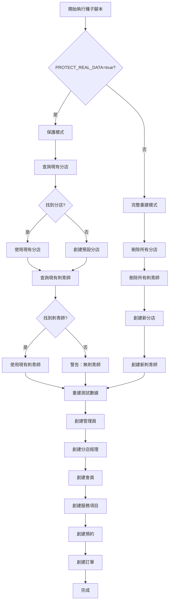

# 數據種子保護機制說明

## 📋 概述

為了保護生產環境中的真實數據（分店和刺青師），我們在種子腳本中添加了**數據保護模式**。

---

## 🛡️ 保護模式說明

### 環境變數控制

通過設置 `PROTECT_REAL_DATA` 環境變數來控制種子腳本的行為：

| 環境變數 | 值 | 行為 |
|---------|-----|------|
| `PROTECT_REAL_DATA` | `true` | **保護模式**：保留現有分店和刺青師，只重建測試數據 |
| `PROTECT_REAL_DATA` | `false` | **完整重建模式**：重建所有數據（包括分店和刺青師）|

---

## 📦 保護的數據類型

### ✅ 保護模式下**保留**的數據：
1. **分店（Branch）**
   - 三重店
   - 東港店
   
2. **刺青師（Artist）**
   - 陳震宇（東港店）
   - 黃晨洋（三重店）
   - 林承葉（三重店）
   
3. **刺青師的用戶帳號（User，role: ARTIST）**

### 🔄 保護模式下**重建**的數據：
1. **管理員帳號（User，role: BOSS）**
2. **分店經理（User，role: BRANCH_MANAGER）**
3. **會員帳號（User，role: MEMBER）**
4. **會員資料（Member）**
5. **服務項目（Service）**
6. **預約（Appointment）**
7. **訂單（Order）**
8. **分期記錄（Installment）**

---

## 🚀 使用方法

### 本地開發環境

#### 方法 1：使用環境變數文件（推薦）

編輯 `backend/.env` 文件：

```bash
# 保護模式（保留分店和刺青師）
PROTECT_REAL_DATA="true"

# 或

# 完整重建模式（重建所有數據）
PROTECT_REAL_DATA="false"
```

然後執行種子腳本：

```bash
cd backend
npm run seed
```

#### 方法 2：臨時環境變數

```bash
cd backend

# 保護模式
PROTECT_REAL_DATA=true npm run seed

# 完整重建模式
PROTECT_REAL_DATA=false npm run seed
```

---

### 生產環境（Railway）

#### 設置環境變數

1. 登入 Railway
2. 進入您的專案
3. 選擇 **backend** 服務
4. 點擊 **Variables** 標籤
5. 添加新變數：
   - **Name:** `PROTECT_REAL_DATA`
   - **Value:** `true`（推薦用於生產環境）
6. 點擊 **Save**

#### 執行種子腳本

使用 Railway CLI 或 Shell：

```bash
npm run seed
```

或使用腳本：

```bash
bash backend/scripts/reseed.sh
```

---

## 📊 保護模式工作流程



---

## 💡 使用建議

### 本地開發

```bash
# 第一次設置 - 完整重建
PROTECT_REAL_DATA=false npm run seed

# 後續測試 - 保護模式（保留分店和刺青師）
PROTECT_REAL_DATA=true npm run seed
```

### 生產環境

```bash
# 始終使用保護模式
PROTECT_REAL_DATA=true npm run seed
```

---

## ⚙️ 技術細節

### 種子腳本邏輯（`backend/prisma/seed.ts`）

```typescript
// 檢查是否保護真實數據
const PROTECT_REAL_DATA = process.env.PROTECT_REAL_DATA === 'true';

if (PROTECT_REAL_DATA) {
  console.log('🛡️ 保護模式：將保留現有的分店和刺青師數據');
} else {
  console.log('⚠️ 完整重建模式：將重建所有數據（包括分店和刺青師）');
}

// 清理數據時跳過分店和刺青師
if (!PROTECT_REAL_DATA) {
  await prisma.branch.deleteMany();
  await prisma.artist.deleteMany();
} else {
  console.log('🛡️ 保護模式：保留分店和刺青師數據');
}

// 讀取或創建分店
if (PROTECT_REAL_DATA) {
  branches = await prisma.branch.findMany();
  console.log(`✅ 保護模式：讀取現有 ${branches.length} 個分店`);
} else {
  // 創建新分店...
}

// 讀取或創建刺青師
if (PROTECT_REAL_DATA) {
  artists = await prisma.artist.findMany({ include: { user: true } });
  console.log(`✅ 保護模式：讀取現有 ${artists.length} 個刺青師`);
} else {
  // 創建新刺青師...
}
```

---

## 🎯 實際應用場景

### 場景 1：本地開發測試訂單流程

```bash
# 保留分店和刺青師，只重建測試訂單
cd backend
PROTECT_REAL_DATA=true npm run seed
```

### 場景 2：完全重置本地環境

```bash
# 重建所有數據
cd backend
bash scripts/reseed.sh
# 或
PROTECT_REAL_DATA=false npm run seed
```

### 場景 3：生產環境數據修復

```bash
# 設置 Railway 環境變數 PROTECT_REAL_DATA=true
# 然後執行
railway run npm run seed
```

---

## 🚨 注意事項

1. **保護模式不是備份**
   - 保護模式只是在重建時跳過分店和刺青師
   - 重要數據請定期備份

2. **管理員帳號會重置**
   - 即使在保護模式下，管理員帳號也會重新創建
   - 預設密碼：`12345678`

3. **會員和預約會重建**
   - 保護模式會刪除並重建所有測試數據
   - 只保留分店和刺青師

4. **生產環境建議**
   - 始終設置 `PROTECT_REAL_DATA=true`
   - 避免意外刪除真實數據

---

## 📝 相關文件

- `backend/prisma/seed.ts` - 種子腳本主文件
- `backend/env.example` - 環境變數範例
- `backend/scripts/reseed.sh` - 自動重建腳本
- `backend/scripts/reset-database.ts` - 數據庫重置腳本

---

## ✅ 總結

| 模式 | 適用場景 | 保留數據 | 重建數據 |
|------|----------|----------|----------|
| **保護模式** (`true`) | 生產環境、測試訂單流程 | 分店、刺青師 | 管理員、會員、預約、訂單 |
| **完整重建** (`false`) | 本地初始化、完全重置 | 無 | 所有數據 |

**推薦設置：**
- 本地開發：`PROTECT_REAL_DATA=false`（第一次）→ `true`（後續）
- 生產環境：`PROTECT_REAL_DATA=true`（始終）

---

最後更新：2025-10-15

